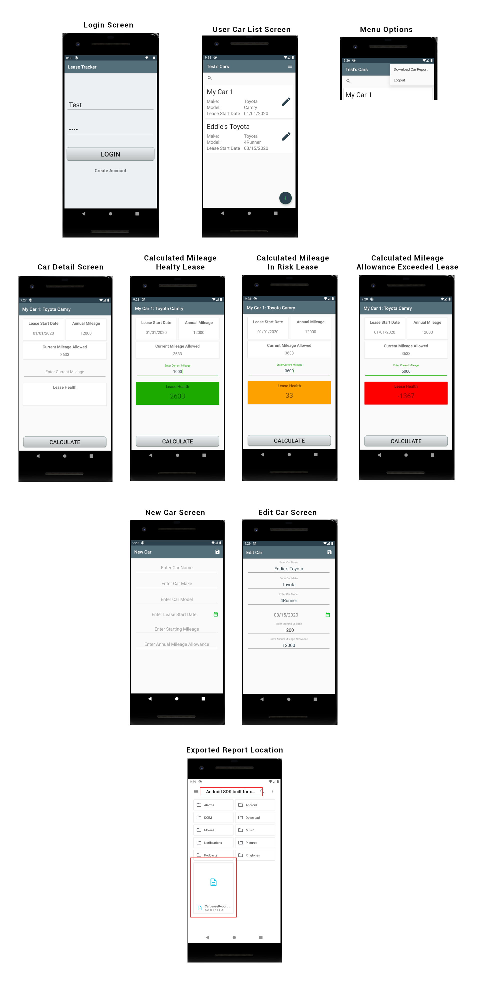

# TE_LeaseTracker_C868
Lease Tracker Android Application

Below you can find the overall flow of the application. 
This application uses a SQLite ROOM DB in conjunction with the MVVM architecture design. 

Features include:
- Log in/out
- Add/Delete Users
- Add/Delete Cars
- Search cars by name for current user
- Calculate mileage allowance
- Edit Cars
- Export Car report in csv format
- Permission requests

